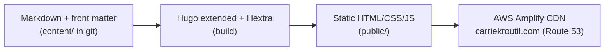
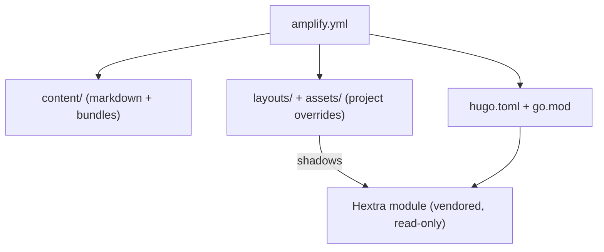

# Architecture Spine — carriekroutil.com

## Design Paradigm

**Build-time static generation, content-as-source.** The whole system is a pure, one-way pipeline with no runtime server state — the git repo is the single source of truth, and every deploy is reproducible from source:



Layers map to directories: **content** (`content/`) → **presentation** (`layouts/`, `assets/` — project overrides shadowing the Hextra module) → **configuration** (`hugo.toml`, `go.mod`) → **delivery** (`amplify.yml`). Authoring touches only `content/`; everything downstream is mechanical.

## Invariants & Rules

Dependency direction — project files may shadow the Hextra module, never the reverse; content depends on nothing:



### AD-1 — The authoring loop is inviolable `[ADOPTED]`
- **Binds:** FR-10, FR-16, SM-2, `all`
- **Prevents:** any process step that could make Carrie hesitate to post — the failure the whole product guards against.
- **Rule:** Publishing is exactly `write markdown → git push`. No CMS, login, web editor, or manual copy/upload step may ever enter the path. Any feature that adds a manual authoring step is a regression, not progress.

### AD-2 — Exactly one deploy pipeline, building from source `[ADOPTED]`
- **Binds:** FR-10, FR-11
- **Prevents:** the retired project's multi-path mess (S3-sync action + GCP App Engine) reappearing; two pipelines racing.
- **Rule:** AWS Amplify is the only pipeline; it builds the site from source on push to the **default branch only** of `carriekroutil-site` and serves it at `carriekroutil.com` via Route 53. Branch/PR auto-previews are **off** (the single-pipeline rule); the only pre-publish preview is local `hugo server` (FR-16). No S3-sync GitHub Action, no GCP artifacts, no second deploy path in the repo. There is exactly one environment: production.

### AD-3 — Canonical post front-matter contract
- **Binds:** all posts; FR-5, FR-6, FR-7, FR-15
- **Prevents:** independently-authored posts diverging on field names/shapes — the highest-divergence-risk surface on the site.
- **Rule:** Every post carries **YAML** (`---`) front matter:
  - `title` (string)
  - `date` (RFC-3339/ISO; missing or invalid **fails the build**, never silently mis-sorts)
  - `tags` (list; open taxonomy; authored **lowercase** — see Conventions)
  - `draft` (bool; drafts excluded from build + stream)
  - `featured` (optional bool; AD-7)
  - `hero` (optional map: `{ src: <path within the bundle>, alt: <required string> }`) — the **one** named hero field; the OG/Twitter partial (FR-18) reads `hero.src` / `hero.alt`, so there is a single source.
  - Read-time is **derived** from `.ReadingTime` — never hand-entered — and rendered as `"{n} min read"`, floor **1 min**.

### AD-4 — Post stream is a `type: blog` section at `/posts/` `[ADOPTED]`
- **Binds:** FR-4, FR-5, URL scheme
- **Prevents:** Hextra's default `content/blog/` (which would change the public URL) or a plain section that misses Hextra's blog layout; two posts diverging on what determines their URL.
- **Rule:** Posts live in `content/posts/`, whose `_index.md` sets `type: blog` and is the **only** home for section-level config. This preserves the `/posts/{slug}/` URLs and activates Hextra's native blog list + single layouts. **The slug derives from the post bundle's folder name**; a front-matter `slug:` is permitted only as a deliberate override; the title never determines the URL. Slugs are stable and human-readable.

### AD-5 — All customization lives in project overrides, never in the module
- **Binds:** every custom layout/partial/style; NFR-4
- **Prevents:** edits lost on theme upgrade; the same override authored in two different places.
- **Rule:** Custom partials, layout overrides, and CSS live in the project's own `layouts/` and `assets/`, shadowing the Hextra module by Hugo's lookup order. The Hextra module is treated as read-only and is **never** edited in place.

### AD-6 — Home preview + featured cards are one custom partial porting the UX mock
- **Binds:** FR-2, FR-15, Home
- **Prevents:** assuming Hextra auto-populates a latest-posts feed (it does not); divergent card markup between Home and the list page.
- **Rule:** A single custom partial (e.g. `layouts/_partials/custom/post-card.html`) renders the card design **ported from the finalized UX `home.html` mockup**, and is the **one renderer used by both** the Home preview grid *and* the `/posts/` list (the blog `list.html` is overridden to call the same partial). The native `hextra-card` does not match the UX card design and is not used for posts.

### AD-7 — Featured post is a front-matter flag, single slot
- **Binds:** FR-15, Home, AD-1
- **Prevents:** a second, non-markdown place to curate; an empty featured slot.
- **Rule:** A post is featured by `featured: true` in its own front matter. Home renders exactly one featured slot: featured candidates are sorted by `date` **descending** and the first is taken (deterministic tiebreak if more than one is flagged); when none is flagged it falls back to most-recent using the same date-desc ordering.

### AD-8 — Topic filtering is tag term-pages only, no client JS
- **Binds:** FR-4, FR-8, NFR-1 (no-JS core)
- **Prevents:** a JavaScript dependency on a core reading surface; custom filter code to maintain.
- **Rule:** A Topic Chip links to `/tags/{topic}/`. Hugo **core** generates the term page and the tag-filtering is native; **Hextra ships no styled term layout**, so the term page is styled as a post list via a custom `layouts/_default/term.html` override (reusing the AD-6 card partial, per AD-5). `/posts/` stays the full reverse-chron stream. No in-place client-side filtering of the stream.

### AD-9 — Images via page bundles; alt required; processing deferred
- **Binds:** FR-5, NFR-1, NFR-2
- **Prevents:** images detached from their post; missing alt text; build complexity at launch.
- **Rule:** Each post is a Hugo page bundle (folder; images beside the markdown, self-contained/portable). Hero via the `hero` map (AD-3); inline via standard markdown. **Alt text is enforced, not just requested:** a minimal `layouts/_default/_markup/render-image.html` markup hook **fails the build** on an empty alt. (This markup hook is distinct from — and ships in v1 despite — the still-deferred resize/responsive/WebP *processing*.) Lazy-loading is Hextra-native.

### AD-10 — Versions are pinned; upgrades are deliberate
- **Binds:** deploy pipeline, NFR-4
- **Prevents:** a future Hugo or Hextra release silently breaking a content-only push.
- **Rule:** Hugo (extended) is pinned via the Amplify build env (`HUGO_VERSION`); the Hextra module version is locked in `go.mod`. Upgrades happen on purpose (`hugo mod get -u` + re-test), never automatically.

### AD-11 — `amplify.yml` is the single source of build truth
- **Binds:** FR-10, FR-11, AD-2
- **Prevents:** build-config drift; an unpinned Hugo in CI; a second build path.
- **Rule:** `amplify.yml` at the repo root defines the build: `preBuild` fetches the Hextra module (`hugo mod get`), `build` runs Hugo extended (`hugo --gc --minify`) at the pinned `HUGO_VERSION`, artifacts = `public/`.

### AD-12 — Build failure must notify, never silently no-op
- **Binds:** FR-17, AD-1
- **Prevents:** a broken push silently leaving the old site up with no signal.
- **Rule:** Amplify's native email-on-failure is enabled. Amplify swaps to a new build only on success, so a failed build keeps the prior good site live **and** emails Carrie. A successful build with no new published post is distinguishable from a failure.

### AD-13 — Core reading works without JavaScript `[ADOPTED]`
- **Binds:** all reading surfaces; NFR-1
- **Prevents:** a contributor adding a JS dependency to a core reading path.
- **Rule:** Home, post pages, the stream, about, and tag pages render and read as static HTML with JS disabled. Hextra's FlexSearch is the single accepted JS-dependent exception and must degrade gracefully. No web-font network load (system-font stacks only).

## Consistency Conventions

| Concern | Convention |
| --- | --- |
| Front-matter format | YAML (`---`) for all content `[ADOPTED]` (AD-3) |
| Post location & URL | `content/posts/{slug}/`, served at `/posts/{slug}/`; slug = bundle folder name (AD-4) |
| Override location | project `layouts/` + `assets/` only (AD-5) |
| Tags / taxonomy | open taxonomy, no fixed allowlist `[ADOPTED]`; tags authored **lowercase** so `Golf`/`golf` don't split into two term pages |
| Dates | RFC-3339/ISO in front matter; invalid/missing fails the build (AD-3); displayed site-wide as `Jan 2, 2006` |
| Drafts vs future dates | `draft: true` is the explicit withhold mechanism; `buildFuture = false`, so a future `date` intentionally withholds a post until that date (never a silent vanish) |
| Read-time | `"{n} min read"`, floor 1 min (AD-3) |
| Alt text | required on every content image, **build-failing** via the `render-image.html` hook + `hero.alt` (AD-9) |
| Theme default | dark by default (`params.theme.default: dark`); dark is the AA-guaranteed path; light ships untuned Hextra defaults `[ADOPTED]` |
| Visual tokens | owned by the UX spine (`DESIGN.md`) — palette, 920px content / 720px reading width, gradient-as-garnish — authoritative; this spine does not restate them |
| Branding | `hugo.toml` `baseURL = https://carriekroutil.com/` and `title` reflect carriekroutil.com; zero SheBytes / `code.shebytes.io` / ananke / quickstart remnants `[ADOPTED]` (FR-11) |
| Privacy | no consent-requiring cookies, no PII; any analytics is a single privacy-friendly script include (NFR-3) |

## Stack

*Seed — web-verified current at authoring (2026-06-22); the code owns this once it exists.*

| Name | Version |
| --- | --- |
| Hugo (extended) | ≥ 0.146.0 (Hextra v0.12.3 floor); pin a current release (~0.163.x as of 2026-06) via `HUGO_VERSION` — re-check the extended/standard edition at upgrade time |
| Hextra theme | v0.12.3 (locked in `go.mod`), via Hugo Modules `github.com/imfing/hextra` |
| Hosting / CDN | AWS Amplify (build-from-source) |
| DNS | AWS Route 53 — `carriekroutil.com` |
| Search | Hextra FlexSearch (built-in, client-side) |
| Fallback theme | FixIt (candidate fallback if Hextra disappoints) |

## Structural Seed

The greenfield build lands fresh in `carriekroutil-site` (currently BMad tooling only) — nothing carried over from `~/code/quickstart`:

```text
carriekroutil-site/
  hugo.toml            # baseURL, title, module import, params (theme.default=dark, search, taxonomy)
  go.mod / go.sum      # Hextra module version lock (AD-10)
  amplify.yml          # build spec — pinned Hugo, hugo mod get, public/ (AD-11)
  content/
    _index.md          # home content
    about.md           # /about/ (FR-3)
    posts/
      _index.md        # type: blog  (AD-4)
      {slug}/          # page bundle = post + its images (AD-9)
        index.md
        hero.jpg
  layouts/
    _partials/custom/        # post-card.html (one card renderer: home + list + term, AD-6); read-time; tag-chips-on-single
    blog/
      list.html              # overridden to call post-card.html (AD-6)
      single.html            # read-time + tag chips on the post (AD-3, AD-5)
    _default/
      term.html              # styled /tags/{topic}/ post list (AD-8) — Hextra ships none
      _markup/
        render-image.html    # build-fails on empty alt (AD-9)
  assets/                    # custom CSS realizing UX tokens (AD-5)
  static/              # favicon, shared non-post assets
```

## Capability → Architecture Map

| Capability / Area | Lives in | Governed by |
| --- | --- | --- |
| Home hero + preview grid (FR-1, FR-2) | `_partials/custom/post-card.html`, home layout | AD-6, AD-13 |
| Featured post (FR-15) | front-matter `featured` + home cards partial | AD-7, AD-6 |
| About (FR-3) | `content/about.md` | AD-13 |
| Post stream + single (FR-4, FR-5) | `content/posts/` (`type: blog`) + Hextra blog layouts | AD-4, AD-9 |
| Read-time + metadata (FR-6) | read-time partial override | AD-3, AD-5 |
| Topic chips + tag pages (FR-7, FR-8) | front-matter `tags` + custom `_default/term.html` | AD-8, AD-5, AD-3 |
| Search (FR-9) | Hextra FlexSearch (config) | AD-13 |
| Authoring + deploy (FR-10, FR-11, FR-16, FR-17) | `amplify.yml`, Amplify, `hugo server` | AD-1, AD-2, AD-11, AD-12 |
| Brand / theme (FR-12, FR-13) | `assets/` CSS, `hugo.toml` params | conventions, UX spine |
| Discoverability (FR-18) | Hugo/Hextra sitemap + OG defaults | conventions |

## Deferred

Pushed down on purpose — none are launch gates:

- **Analytics tool (FR-14)** — GoatCounter vs Cloudflare Web Analytics; a single privacy-friendly script include, chosen at/just after launch. Capability defined; choice deferred. *Revisit at launch — don't let it drift.*
- **Light-mode AA (NFR-2)** — re-verify the three accents on Hextra's light surfaces before relying on light mode. Dark is the AA-guaranteed v1 path.
- **Image resize/WebP** — a custom `render-image.html` hook using Hugo image processing, added only if images get heavy (AD-9).
- **Custom 404** — on-brand "wandered off the fairway" copy; non-blocking.
- **Legacy deploy cleanup** — disabling the old `~/code/quickstart` S3-sync action + removing GCP artifacts is Carrie's manual one-time task, outside this repo (FR-11 only requires they are not carried in).
