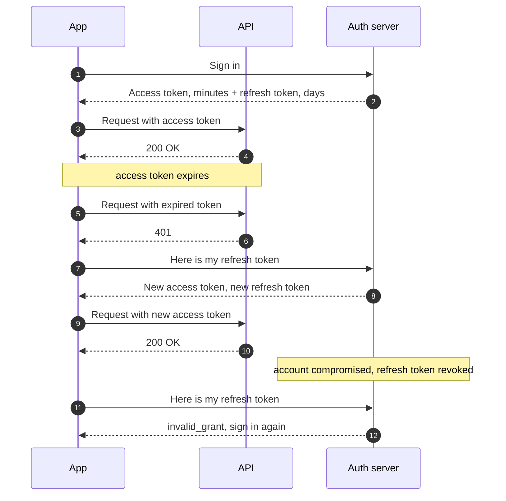
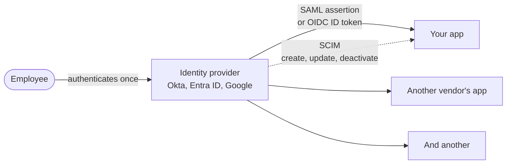
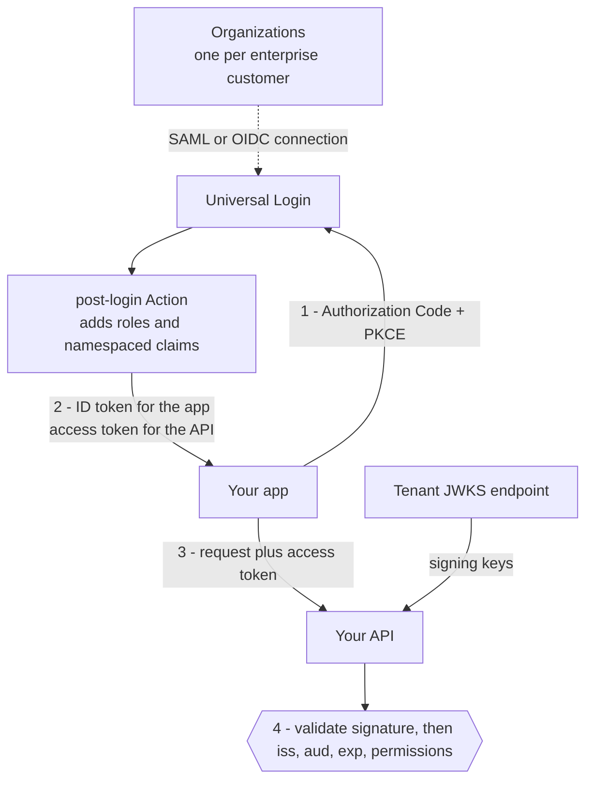

Almost every system your team builds has to answer two questions before it does anything useful: *who is this?* and *what are they allowed to do?* Those are different questions with different failure modes, and treating them as one thing is the root of a surprising number of security bugs. You don't need to implement any of this by hand — you almost certainly shouldn't — but you do need enough vocabulary to follow a design review and ask the question that saves you six months later. This page works outward from that distinction: how people prove who they are, how a system remembers it, the protocols that carry it between organizations, and what changes on a phone, between services, and once a customer's IT department gets involved.

## AuthN vs AuthZ

They get abbreviated almost identically, which doesn't help.

| | Authentication (authN) | Authorization (authZ) |
|-------------------|-------------------------------------|-------------------------------------------|
| **The question** | Who are you? | What are you allowed to do? |
| **Happens** | Once, at the start of a session | On every request, for every resource |
| **Evidence** | Passwords, passkeys, tokens, factors | Roles, permissions, scopes, policies |
| **Failure mode** | Someone logs in as another person | A real user reaches data that isn't theirs |

The second row is the one worth internalizing. Authentication is a gate you pass through; authorization is a check you keep making. A system that authenticates perfectly and authorizes carelessly will happily hand a logged-in customer someone else's invoice — which is why **broken access control** sits at the top of the [OWASP Top 10]() rather than anything to do with login.

## Authorization models

Once you know who someone is, you have to decide what they can reach. Permission models tend to grow in the same order.

- **A role column.** One field on the user record — admin, member, viewer. Fine early, and it fails the moment two people need overlapping-but-different access.
- **RBAC (role-based access control).** Permissions attach to named roles, and users get roles. The workhorse: understandable, auditable, and enough for most products. It strains when roles start multiplying to encode exceptions.
- **ABAC (attribute-based access control).** Decisions come from attributes and rules — this user's department, this document's owner, the time of day. Far more expressive, considerably more to reason about and test.

The failure pattern is predictable: a role list that keeps growing because each new customer needs a slightly different cut. Watch for roles named after individual accounts. That's the signal you've outgrown RBAC and are encoding attributes in role names.

The other thing worth insisting on: **authorization checks belong on the server, every time.** Hiding a button in the UI is a usability choice, not a security control — anyone can call the API directly. Most access-control bugs are a missing check on an endpoint nobody thought to test, which is exactly the kind of gap a [tech-design review]() is good at catching.

## Factors and passkeys

That's the authorization half. Getting to the point where you know who someone is starts with **factors**. A factor is a piece of evidence, and the classic three are something you know (a password), something you have (a phone, a hardware key), and something you are (a fingerprint, a face). **Multi-factor authentication** just means requiring more than one, which matters because passwords leak in bulk and a second factor makes a stolen password much less useful on its own.

Not all second factors are equal. Codes sent over SMS are far better than nothing and meaningfully worse than the alternatives — they can be intercepted, and phone numbers can be taken over. Authenticator apps are a solid step up. **Passkeys**, built on the WebAuthn standard, are where this is heading: a key pair where the private half never leaves the user's device, which means there's no shared secret to phish and nothing useful for an attacker to steal from your database.


Passkeys are the rare security improvement that also makes the experience better — no password to remember, no code to retype. If your product still treats "add MFA" as a someday item, look at whether passkeys get you further than bolting a second factor onto a password flow you'd rather retire.


## Passwords and account recovery

Buying an identity provider means you probably aren't storing passwords — but you will inherit systems that do, and the recovery flow is yours to reason about either way.

**Storage.** A password must never be stored in a form anyone can reverse, which rules out plaintext and encryption alike. Hash it with an algorithm designed to be *slow* — bcrypt, scrypt, or Argon2. General-purpose hashes like SHA-256 are the wrong tool precisely because they're fast: a GPU works through billions of guesses a second, so speed is the attacker's advantage. Each password also gets a unique salt so identical passwords don't produce identical hashes, which the modern algorithms handle for you.

**The rules changed, and a lot of teams didn't notice.** NIST's guidance in SP 800-63B was revised in 2025, and it inverts advice many organizations still enforce: favour length over complexity, drop composition rules like "one symbol and one capital," and **stop forcing periodic rotation** — change a password on evidence of compromise, not on a ninety-day timer. Forced rotation made things worse in practice, because people responded with predictable increments. What it adds instead is screening new passwords against lists of breached and common ones, and supporting genuinely long passphrases rather than truncating at some legacy limit.

**Credential stuffing is the attack to understand.** Attackers aren't usually guessing your users' passwords; they're replaying username and password pairs harvested from someone else's breach, betting on reuse. That's why breach-list screening and MFA matter more than complexity rules — neither length nor symbols help when the password is already correct somewhere else.

**Account recovery is an alternate way in, so it has to be as strong as the front door.** An attacker who owns your reset flow never needs the password at all. That means reset links that are single-use, short-lived, and unguessable; responses that don't reveal whether an account exists; and existing sessions invalidated when a password changes. The one people miss is the email address itself — if changing it doesn't require re-verifying the current one, an attacker with a borrowed session can quietly redirect every future reset to themselves.

## Sessions vs tokens

Once someone proves who they are, the system needs to remember it — otherwise they'd re-authenticate on every single request, which is exactly what **HTTP Basic authentication** does and why almost nothing user-facing uses it anymore. There are two broad approaches to remembering, and the trade-off between them comes up constantly.

**Server-side sessions.** The server stores the session and hands the browser a cookie holding nothing but an ID. State lives with you, so you can revoke a session instantly — log someone out, kill every session after a password reset, cut off a compromised account. The cost is that your servers need shared access to that session store.

**Stateless tokens (JWTs).** A **JSON Web Token**, usually pronounced "jot," is the format almost everyone means when they say "token." The token itself carries the claims — who the user is, what they can do, when it expires — signed so the server can verify it without a lookup. Nothing to store, nothing to share, which is why it scales well across services.

The catch nobody mentions until it bites: **a stateless token can't easily be revoked.** If it's valid for an hour and you need to cut off access now, the token keeps working until it expires, because verifying it involves no lookup at all. The usual answer is short-lived access tokens plus a longer-lived refresh token you *can* revoke — which quietly reintroduces the server-side state you were avoiding.

### What's actually in a JWT

It's worth knowing the shape, because two of the attacks later on this page live inside it. A JWT is three chunks of Base64url text joined by dots:

| Part | Holds | Example fields |
|---------------|--------------------------------------------|-------------------------|
| **Header** | How the token is signed | `alg`, `kid` |
| **Payload** | The claims — who, what, for whom, how long | `sub`, `aud`, `iss`, `exp` |
| **Signature** | Proof the other two weren't altered | — |

The part that surprises people: **a JWT is signed, not encrypted.** Base64url is encoding, not secrecy — anyone holding the token can read every claim in it, and a decoder will show them the contents in a second. The signature guarantees *integrity* (nobody tampered with this) and says nothing about *confidentiality* (nobody else can read this).

The practical consequence is a data question more than a security one: whatever you put in a payload, you are handing to every party that ever holds the token. Internal identifiers, role names that reveal your org structure, and anything resembling personal data are all worth a second look — the same [collect-only-what-you-need instinct]() that saves you compliance surface elsewhere.


The main thing a JWT buys you is that a server can check it without looking anything up, which matters when a dozen services would otherwise all be querying one session store. If you're a single app with a single database, that's not a problem you have — and server-side sessions are simpler and revoke instantly. Reaching for tokens anyway means paying the revocation cost for a scaling benefit you aren't using. Whichever way it goes, ask what happens when you need to force a logout: during an incident, after a firing, when an account is compromised. If the answer is "wait for it to expire," find out how long that window is and whether anyone can live with it.


## The two-token split

That protip has an answer, and it's the pattern almost every token-based system lands on: issue **two** tokens with very different jobs and very different lifetimes.

| | Access token | Refresh token |
|-----------------|--------------------------------------|----------------------------------------|
| **Presented to** | Every API, on every request | The auth server, and nothing else |
| **Lifetime** | Minutes | Days to months |
| **Job** | Prove this request is allowed | Get a new access token |
| **If stolen** | Attacker has a short window | Attacker has a long-lived foothold |

The split exists because the two tokens have wildly different blast radii. The access token travels constantly — to every service, through every proxy, into logs and error reports. The refresh token goes to exactly one endpoint on one server. So you make the widely-traveled one expire fast, and keep the long-lived one in as few places as possible.

Here's the whole dance, including the part that matters:

Steps 1 through 10 are the happy path, and users never see any of it — the refresh happens in the background. Step 11 is the reason the design exists.

### The number to ask about

Notice what revocation actually does. Killing the refresh token doesn't cut off access instantly. For the same reason as before, the access token already in the wild keeps working until its own expiry. **Your access token lifetime is your worst-case revocation window.** If access tokens live fifteen minutes, then "revoke immediately" means "up to fifteen minutes." That's the number to ask for when someone says access can be cut off right away, and it's usually the first time anyone has put a figure on it.

That makes token lifetime a dial rather than a default. Shorter access tokens tighten the revocation window and cost you more refresh round-trips. Longer ones cut the chatter and widen the window a thief can work in. Neither end is correct in the abstract — it depends on what the token can reach.

### Rotation

The remaining problem is the refresh token itself: it's long-lived, so a stolen one is valuable. **Refresh token rotation** is the standard answer. Every refresh issues a *new* refresh token and invalidates the one just used, so each token is single-use.

The clever part is what happens on reuse. If an old, already-spent refresh token shows up again, something is wrong — either the legitimate app is replaying, or somebody stole it and is racing the real user. Either way the server can't tell which caller is genuine, so it invalidates the entire chain and forces a fresh sign-in. Theft turns into a detectable event instead of a silent, indefinite foothold.

Which brings the whole thing back around: the auth server now tracks issued refresh tokens, which are valid, and which chain each belongs to. That's server-side state — the very thing stateless tokens were meant to avoid. The honest framing is that you didn't eliminate it. You moved it to one service and made the busy path, checking an access token on every API call, the part that stays stateless.

## The protocol alphabet

Three acronyms do most of the work here, and the first one is routinely misdescribed.

| | What it actually does | You'll meet it |
|-----------|---------------------------------------------------------------|-------------------------------------------|
| **OAuth 2.0** | *Delegated authorization* — lets an app act on your behalf | "Connect your calendar," API access tokens |
| **OIDC** | *Authentication*, layered on top of OAuth 2.0 | "Sign in with Google," modern consumer login |
| **SAML** | Enterprise SSO via signed XML assertions | Corporate logins, older identity providers |

**OAuth 2.0** is about *permission*, not identity. When you let an app read your calendar without giving it your password, that's OAuth: you're delegating a scoped, revocable slice of access. It was never designed to tell an application who you are, and building login on raw OAuth is a well-known way to get it subtly wrong.

**OIDC (OpenID Connect)** is the layer that fixes exactly that. It adds a standard identity token on top of OAuth 2.0, so the application gets a verifiable answer to "who is this person." When you see "Sign in with Google," that's OIDC. For new work, this is almost always the right choice.

**SAML** predates both and still runs enormous amounts of enterprise SSO. It's XML-based, it's verbose, and it is not going anywhere, for reasons worth a [section of its own](#saml) below.

## Flows, PKCE, and where the token lives

OAuth defines several *flows* for different shapes of application. You don't need them all, but you need to recognize the one that's current and the one that isn't.

**Authorization Code flow with PKCE** (pronounced "pixie") is the answer for essentially every new application. The app generates a one-time secret, sends a hash of it when it starts the flow, and proves it holds the original when it exchanges the code for a token. That extra step means an authorization code stolen in transit is useless on its own. PKCE started as a fix for mobile apps, which can't keep a client secret secret, and is now recommended across the board.

The one to recognize as a red flag is the older **implicit flow**, which handed the access token back directly in the URL — where it lands in browser history, referrer headers, and server logs. It has been steadily deprecated. If a design review turns up implicit flow, that's a finding, not a preference.

Then there's the question the flow doesn't answer: **where does the token actually live afterward?** The IETF published its best current practice on this in August 2026 — [RFC 10017](https://www.rfc-editor.org/info/rfc10017/), *OAuth 2.0 for Browser-Based Applications* — and it ranks three patterns:

| Pattern | Where tokens live | Verdict |
|-------------------------------|-------------------------------------|--------------------------------------------|
| **Backend for Frontend (BFF)** | Server only; browser holds a cookie | Strongly recommended for sensitive apps |
| **Token-mediating backend** | Backend gets them, browser gets the access token | Middle ground; token still exposed |
| **Browser-based client** | Entirely in the browser | Least secure of the three |

This is worth flagging because the received wisdom shifted. For years the standard advice for a single-page app was "Authorization Code + PKCE, no backend needed," and that's still correct as far as it goes — PKCE beats implicit, always. But the current guidance is that if your app handles personal or business data and you *can* put a backend in front of it, the tokens belong there. Which is the [sessions-versus-tokens](#sessions-vs-tokens) trade-off again, arriving from the other direction: BFF is a server-side session wearing modern clothes.


The question to ask in a front-end design review is "where does the access token actually live, and what code can read it?" If the answer is browser storage, then any cross-site scripting bug anywhere on the page — including in a third-party script you didn't write — becomes a token theft. That reframes XSS from a front-end bug into an authentication problem, which is usually when it starts getting the attention it deserves.


## Token validation

A handful of parameters and claims come up constantly once a team starts implementing any of this, and they look like protocol bookkeeping until you know which attack each one exists to stop. They're worth recognizing for one reason: **every one is a check your library performs when it's configured correctly and silently skips when it isn't.** A token that "works" tells you nothing about whether it was actually validated — the unhappy paths are the whole point, and they don't show up in a demo.

### In the flow: `state`, `nonce`, and PKCE

These get conflated constantly, because all three are random values your app generates, sends out, and expects to see again. They stop different attacks at different moments.

| | `state` | `nonce` | PKCE |
|-----------------------|--------------------------------|-----------------------------------|----------------------------------|
| **Question it answers** | Is this the login response I asked for? | Is this ID token from the login I just started? | Is the app redeeming this code the one that requested it? |
| **Stops** | CSRF | Replay | Code interception and injection |
| **Checked when** | The redirect comes back | The ID token is validated | The code is exchanged for tokens |
| **Checked against** | A value saved in your session | A value carried inside the ID token | The `code_verifier` the app kept |
| **Applies to** | OAuth and OIDC | OIDC only | OAuth and OIDC |

The **checked when** row is the one that makes them stop blurring together: each is inspected at a different point, so no one of them can cover for another in general.

The distinction underneath `state` and `nonce` is **CSRF versus replay**, and it's worth stating plainly because it generalizes well beyond OAuth. A *CSRF* attack forges the flow: the attacker gets your browser to complete a login round-trip they started, so you end up operating inside their session rather than your own. Nothing is stolen — a fresh, legitimate-looking exchange is fabricated. A *replay* attack does the opposite: it takes a genuine artifact from a real, earlier session and presents it again. The token is authentic; only its freshness is a lie. So `state` protects the round trip, and `nonce` protects the token.

PKCE overlaps with `state` on exactly one square of that grid. Because the authorization server won't exchange a code without the matching `code_verifier`, an attacker can't inject their own code into your session — which is the CSRF case. OAuth 2.1 acknowledges this and lets a client rely on PKCE rather than `state` for CSRF protection. That does *not* make `state` pointless: it's still the natural place to carry application state, like remembering which page the user was heading to before you bounced them to a login screen. And `nonce` substitutes for neither, because nothing else binds an ID token to the specific authentication that produced it.

### Inside the token: `alg`, `kid`, `aud`

A JWT carries a header describing how to verify it and a payload of claims. Three fields cause most of the trouble.

| Field | What it says | What goes wrong |
|---------|--------------------------------|--------------------------------------------------------|
| `alg` | Which algorithm signs the token | The token gets to choose it |
| `kid` | Which key to verify against | It's used as an unchecked lookup |
| `aud` | Who the token is for | Nobody checks, and the wrong service accepts it |

**`alg`** names the signing algorithm — and the classic failure is a verifier that reads it from the token and does as it's told, which means an attacker chooses how their own forgery gets checked. The blunt version is `alg: none`, declaring the token unsigned and inviting the server to skip verification; naive string filters get bypassed with odd casing and encodings. The sharper version is **algorithm confusion**: take a token meant to use RS256, where the server verifies with a *public* key, and re-sign it as HS256, where the server verifies with a *shared secret*. A library that picks its algorithm from the header will reach for the RSA public key and use it as the HMAC secret — and public keys are, definitionally, public. The fix is that the server decides which algorithms it accepts, up front, and treats the header as a claim to check rather than an instruction to follow.

**`kid`** is the key ID: which key from the issuer's key set signed this token. That set is published as a **JWKS** — a JSON Web Key Set, a document listing the issuer's current public signing keys, served at a well-known URL like `/.well-known/jwks.json`. A verifier fetches it, finds the key whose ID matches the token's `kid`, and checks the signature against it. Nothing secret is exposed, because these are public keys; the arrangement exists so keys can rotate without downtime. The issuer publishes a new key alongside the old one, starts signing with it, and verifiers pick it up on their next fetch — no coordinated deploy, no shared secret to distribute.

That's also what makes `kid` dangerous when it's handled wrong. Matched against a published key set, it's harmless. Fed straight into a lookup, it's an injection point — as a file path (`../../` traversal, or `/dev/null`, which is empty, letting an attacker sign with an empty secret), or into a database query. It's attacker-controlled input that happens to be spelled like configuration.

**`aud`** — the audience — names who the token was minted for, and it's the one that fails quietly. If your service accepts any well-signed token from your identity provider without checking it was the intended recipient, then a token issued for a different service, or a lower-privilege one, works fine against yours. The signature is valid; it was simply never meant for you. Each service has to confirm it's the intended audience. (You may also meet `azp`, the authorized party — worth recognizing, but the OIDC spec itself encourages implementations not to use it unless an extension requires it.)

The pattern across `alg` and `kid` is worth naming: both are attacker-supplied instructions about how to verify the attacker's own token. **Nothing inside a token should get to decide how that token is checked.**


A concrete test that surfaces most of this: has anyone tried presenting a token from your staging environment against production, or a token minted for one service against a different one? If either is accepted, audience validation isn't happening, and the fix is cheap now and expensive after an incident review. It's a good thing to ask for once, rather than a standing process.


## Mobile and native apps

Native apps get their own best practice — **RFC 8252, *OAuth 2.0 for Native Apps***, which is part of the same BCP 212 as the browser-based guidance above. The two documents are companions, and the reason they're separate is that a phone changes the threat model in ways a browser tab doesn't.

**Authentication belongs in the system browser, not an embedded webview.** RFC 8252 is unusually blunt here: native apps **MUST NOT** use embedded user-agents for authorization requests. The reasoning is that a webview is controlled by the host app, which means the app can log keystrokes, read the credentials as they're typed, and reach the authentication cookies — precisely the access that redirecting to an identity provider was supposed to prevent. In practice this means `ASWebAuthenticationSession` on iOS and Custom Tabs on Android, both of which render outside your app's control. The side benefit is real single sign-on: because those components share the system browser's session, a user already signed in elsewhere may not have to sign in again.

**A shipped binary cannot hold a secret.** Anything compiled into an app that thousands of people have installed is extractable, so native apps are *public clients* — the spec explicitly discourages authorization servers from requiring a shared client secret from them. This is the reason PKCE exists and why RFC 8252 says public native clients **MUST** implement it: it substitutes a fresh per-request secret for the static one you can't safely ship.

**Redirect URIs are a genuine attack surface here.** The spec allows three approaches, and they aren't equal. A **private-use URI scheme** (`com.example.app://callback`) is the familiar one, but on most platforms nothing stops another installed app from registering the same scheme and receiving your authorization code. **Claimed HTTPS URIs** — Universal Links on iOS, App Links on Android — are the stronger option, because the operating system verifies you actually control the domain before routing the callback to you. **Loopback redirects** cover desktop cases. Where you can't use claimed HTTPS, PKCE is what keeps an intercepted code useless.

**Store tokens in the platform's secure storage**, meaning the Keychain on iOS and the Keystore or encrypted preferences on Android — not a plist, not plain shared preferences, not a file in the app's sandbox. Refresh tokens matter more on mobile than anywhere else, because nobody tolerates re-authenticating daily on their phone, which means you are deliberately holding a long-lived credential on a device you don't control. That combination is exactly what rotation and reuse detection exist for.

**Biometrics are a local unlock, not an authentication.** This one is worth stating plainly because it's widely misread. Face ID or a fingerprint proves something to *the device*, and the device then releases a credential it was already holding. Nothing about that biometric reaches your server, and your backend learns nothing about how the user unlocked the app. Treat biometrics as a convenient gate in front of stored tokens — genuinely valuable for that — and not as a factor your backend has verified.

## Machine-to-machine

Everything so far assumes a person is present. A great deal of real authentication has no user at all — a nightly job calling an API, one service calling another, a deployment pipeline reaching a cloud account.

The OAuth answer is the **client credentials grant**. There's no redirect and no browser, because there's nobody to redirect: the service presents its own client ID and secret directly to the authorization server and receives an access token representing *itself*. The token then gets validated exactly like any other.

The consequence worth thinking about is what the token no longer says. It identifies a service, not a person, so anything done with it lands in your audit trail as "the billing service did this." That's fine for genuinely automated work and actively bad for anything a human triggered — if an admin action runs through a shared service identity, you lose the ability to answer who did it. Actions initiated by people should carry the person's identity through to the thing being changed.

Because these run on servers, they're *confidential clients* and can legitimately hold a secret — but that secret is long-lived, sits in configuration, and rotating it is manual and easy to forget. Where your platform supports it, **workload identity federation** is the better shape: the environment itself vouches for the workload — a CI job, a container, a function — over OIDC, and that gets exchanged for a short-lived token. No stored credential, nothing to leak, nothing to rotate.

**API keys** deserve a plain word, since they're everywhere. They're simple and they work, but a typical one never expires, carries coarse permissions, and ends up pasted into logs, scripts, and repositories. That's an acceptable trade for low-risk integrations and a poor foundation for anything sensitive. **Mutual TLS**, where both sides present certificates, is the heavier option for service-to-service traffic that warrants it.

## Single sign-on (SSO)

Single sign-on lets someone authenticate once with their organization's identity provider and reach every connected application without logging in again. The mechanic underneath is a trust relationship: your application stops verifying credentials itself and instead trusts an assertion from somewhere else.

That gives you two roles worth naming, because every vendor doc uses them. The **identity provider** (IdP) holds the accounts and does the authenticating — Okta, Microsoft Entra ID, Google Workspace. The **service provider** (SP), sometimes called the relying party, is your application, which trusts what the IdP says. The practical consequence is the appealing part: your app never sees the user's password, so it can't leak one.

The assertion itself travels over one of the protocols above — a SAML assertion or an OIDC ID token. Which one you support is usually dictated by what the customer's IdP speaks, not by preference, and SAML remains common because large organizations already run it. Flows come in two directions: **SP-initiated**, where the user lands on your app and gets redirected out to authenticate, and **IdP-initiated**, where they start from a tile in their company's dashboard and arrive at your app already vouched for.

Login is only half of it, and the other half gets forgotten. **SCIM** (System for Cross-domain Identity Management) is the companion standard for account *lifecycle* — creating, updating, and deactivating accounts from the IdP. Without it, SSO stops a departing employee from signing in, but their account still sits in your application, along with whatever it can reach. Many teams start with **just-in-time provisioning**, creating an account on first successful SSO login, which handles the joining half and leaves the leaving half unsolved.

Put together, the shape looks like this — and the useful part is that the two channels are separate:

The solid arrows are authentication: one sign-in, many applications, none of them holding a password. The dotted arrow is lifecycle, and it's a different channel doing a different job. Cut someone off at the identity provider and the solid arrows stop immediately — but if you never wired up the dotted one, their account still exists in your app, exactly as they left it.


The thing that catches managers off guard is where this question arrives from: "do you support SAML SSO?" shows up in procurement, not in a design review. A security questionnaire stalls a deal, and identity work scheduled for next year becomes the only thing between you and a signed contract. Worth knowing early whether your product will ever be sold to companies with an IT department — retrofitting SSO into something that assumed individual accounts is meaningfully harder than planning for it.


## SAML

**Security Assertion Markup Language** is the standard that carried enterprise SSO for two decades, and SAML 2.0 — the version everyone means — was finalized in 2005. Its central artifact is the **assertion**: an XML document, cryptographically signed by the identity provider, that says *this person authenticated with me, at this time, and here are their attributes*. Your application's job is to validate that signature and trust what the document says.

The design makes much more sense once you know what it was built for. This was federation between organizations in the early 2000s, when the enterprise ran on XML and SOAP, JSON barely existed, and there were no mobile apps or single-page apps to serve. It's also **browser-mediated by design**: the assertion is Base64-encoded into a hidden form that the browser auto-submits from the identity provider to your app. That looks strange now, but it was the point — federation works through a corporate firewall with nothing but a browser, no direct server-to-server connection required.

Where it strains is exactly where the world moved. There's no clean story for native mobile apps or APIs, the documents are bulky next to a JWT, and certificate handling is largely manual — including rotation, which is a genuine source of outages when a signing certificate expires unnoticed.

It has a distinctive security weakness too, and it rhymes with something earlier on this page. **XML Signature Wrapping** exploits the gap between the component that verifies the signature and the code that reads the user's identity out of the document. An attacker takes a legitimately signed assertion and injects a forged one alongside it, structured so the verifier checks the real element while the application reads the fake one. The signature validates; the app authenticates the wrong person. It's the same family of bug as letting a token's own header choose how it gets verified — verification and interpretation looking at different things.

**What replaces it: OIDC for new work, SCIM for the half SAML never did.** OIDC covers the same ground in JSON, with tokens that suit mobile apps, SPAs, and APIs, and it's the default for anything built today. SCIM handles the account lifecycle SAML only ever gestured at through attribute passing. But "replaced" overstates it in practice — SAML still carries an enormous enterprise and government installed base, and a customer's identity provider is not going to change protocols to accommodate you. Most teams selling into enterprises end up dual-stack: OIDC for their own new work, SAML because a buyer requires it.

## Logout

Signing out looks like the simplest thing on this page and quietly isn't, because "logged out" can mean three different things depending on what's holding the session.

With **server-side sessions** it really is simple: destroy the session record, clear the cookie, done. The user is out everywhere that session reached, immediately.

With **stateless tokens** you hit the revocation problem one more time. Discarding tokens from the client ends that client's access, but any access token already issued stays valid until it expires — nothing checks a list. So logout means revoking the refresh token and accepting that [the access token lifetime](#the-number-to-ask-about) is your exposure window. A user who clicks sign out on a shared machine is trusting that number.

Under **SSO the confusion compounds**, because ending the session in your application does nothing to the session at the identity provider. The user clicks sign out, sees your login screen, clicks sign in — and is straight back in with no prompt, because the IdP still considers them authenticated. Users read that as logout being broken. On a shared computer it's worse than confusing.

OpenID Connect defines three mechanisms for the harder version, and they are not equally reliable:

| Mechanism | How it works | Reliability |
|---|---|---|
| **RP-Initiated Logout** | Your app sends the user to the IdP's end-session endpoint | Solid; ends the IdP session |
| **Front-Channel Logout** | IdP loads each app's logout URL in hidden iframes | Fragile — depends on third-party cookies |
| **Back-Channel Logout** | IdP calls each app's endpoint server to server | The dependable one |

Front-channel logout is the one that decays: browsers have steadily restricted third-party cookies, and it breaks quietly when they do. Back-channel logout is unaffected, which is why it's the one to prefer where an identity provider and your applications both support it. SAML has its own Single Logout with the same class of difficulty and a longer history of partial implementations.

The practical position: prefer back-channel logout, revoke refresh tokens on sign-out, keep access tokens short, and say plainly in the interface what signing out actually ended — especially if it didn't end the session at the identity provider.

## Choosing a provider

Almost nobody should build this. Identity is a solved problem with a very unforgiving failure mode, and rolling your own login is rarely the differentiating work. The real decision is *which* provider, and the honest answer is that there's no best one — there's a best one for what you're optimizing for.

| If you're optimizing for | The usual answer |
|---------------------------------------|-------------------------------------|
| Developer velocity, UI components included | Clerk |
| Enterprise identity — SAML, SCIM, directory sync | WorkOS |
| Staying inside AWS, on cost | Cognito |
| Ownership and no per-user cost | Keycloak, self-hosted |
| Breadth, protocol coverage, documentation | Auth0 |

**Auth0 is where I'd start.** The documentation and protocol coverage are hard to beat, the free tier is generous enough to build on, and the learning material around it — including the Bertocci book in Go Deeper below — is the best in the category. If you have no strong constraint pulling you elsewhere, it's a defensible default.

Two things to check before committing, because they're the ones that hurt later:

**What enterprise SSO actually costs, per connection.** This is the trap that sits directly on top of the [SSO section](#single-sign-on-sso) above. Per-user pricing looks fine while you're consumer-shaped and changes character once enterprise customers arrive, because SSO connections are often priced individually. Teams have reported four-figure monthly bills at a handful of enterprise customers. Get a quote for the shape you expect to be in two years, not the one you're in now.

**How you'd get out.** Identity is the stickiest dependency you will ever pick. Migrating means moving password hashes — if your provider will even export them — or forcing every user to reset, plus re-establishing every enterprise SSO connection one customer at a time. Ask about hash export before you sign, not after. Providers also deprecate their own extension points and hand you the migration, so some of this work finds you whether you switch or not.

None of this argues against buying. It argues for knowing the bill and the exit before the decision is load-bearing.

## A reference design in Auth0

Everything above is protocol-level and portable. This is what it looks like assembled on one platform — useful as a concrete shape even if you pick a different provider, since the decisions map across. Product names move faster than protocols, so treat the specifics as of this writing and the structure as the durable part.

### Getting the user in

**Use Universal Login, not an embedded form.** The user is redirected to a page hosted by the tenant, so credentials never pass through your application and you can't leak what you never held. It's also what the OAuth best practice for native apps requires — authentication belongs in an external user agent, not a webview you control. The side benefit is that MFA, passkeys, social logins, and enterprise connections become configuration rather than code.

**Authorization Code with PKCE, through the maintained SDKs.** This is the [flow section](#flows-pkce-and-where-the-token-lives) made concrete. Don't hand-roll it, and don't accept a tutorial that still demonstrates implicit flow.

### Tokens

**Register your API as an API, with its own identifier.** That identifier becomes the `aud` of the access tokens issued for it, which is what makes [audience validation](#inside-the-token-alg-kid-aud) meaningful rather than theoretical. It also forces the [authN/authZ split](#authn-vs-authz) to be visible in the architecture: your app receives an **ID token** describing who the user is, and a separate **access token** authorizing calls to your API. Two tokens, two jobs, exactly as the protocols intend.

**Decide where tokens live, deliberately.** If you have a backend, put them behind it and give the browser a session cookie — the [backend-for-frontend pattern](#flows-pkce-and-where-the-token-lives) the current IETF best practice recommends. If you're a pure SPA, keep access tokens in memory rather than local storage.

**Turn on refresh token rotation, and know what it does when it fires.** This is the [rotation behaviour](#rotation) described earlier, as a setting. Each exchange returns a new refresh token; if a previously-used one is presented again, Auth0 invalidates the *entire token family* — every token descended from the original issued to that client — and records the reuse event in the tenant logs. Two things follow. The family invalidation means a theft ends in a forced re-login rather than a silent parallel session, and the log event means someone can alert on it, which is the difference between detection and merely having the capability for it. Rotation is specifically recommended for SPAs, since browsers have no secure persistent storage and privacy features actively clear what storage there is.

### Claims and validation

**Use a post-login Action for roles and custom claims.** Actions are versioned Node.js functions that run at defined points in the pipeline; the post-login trigger is where you attach a user's roles or permissions to the token via `api.accessToken.setCustomClaim()`. Namespace custom claims with an HTTPS URL you control. Auth0 permits non-namespaced claims, but namespacing is strongly encouraged and it's what prevents collisions with standard or reserved claims later.

**Validate properly at the API.** Fetch the tenant's signing keys from its JWKS endpoint, then check the signature, `iss`, `aud`, `exp`, and whatever scopes or permissions the endpoint requires. Pin the expected algorithm in your verifier rather than reading it from the token — the [`alg` problem](#inside-the-token-alg-kid-aud) doesn't stop being real because a vendor is involved.

### Keeping things separate

**Run a separate tenant per environment.** Development, staging, and production each get their own, which means different issuers and different signing keys. This is the concrete answer to the test proposed earlier: a staging token presented to production fails on `iss` and on signature verification, because there is no shared key to validate it with. Environment separation and token isolation turn out to be the same setting.

**Use Organizations for B2B.** Each enterprise customer becomes an organization with its own connection to their identity provider, which is where the [SSO](#single-sign-on-sso) and [SAML](#saml) work actually lands. Modelling customers as organizations from the start is considerably less painful than retrofitting tenancy onto a user table that assumed individuals.
