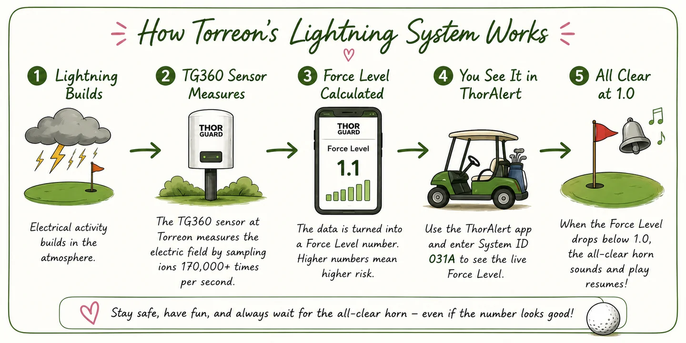

Today I learned something totally new — and pretty cool — while playing the Tower Course at Torreon.

A storm rolled through and the lightning siren went off, which meant everyone off the course and into the clubhouse.

While we were waiting, a guy nearby looked at his phone and said, casually:

> "The ion level is at 1.1. Once it gets to 1.0, we should get the all-clear."

I had no idea what he was talking about.

But a few minutes later…

**The horn sounded.**

He was right.

And of course, now I needed to know **how the heck he knew that.**

## Turns out there's some pretty cool science behind that horn

Torreon uses a lightning warning system from **THOR GUARD**.

Most of what we're used to — the radar app, the lightning map — shows you lightning that has _already happened_. THOR GUARD is doing something different. It watches the electrostatic field in the air right over the property: the static charge that builds up in the atmosphere before a storm produces a strike. Lightning is born inside that field, so if you can watch the field build, you can see a strike coming before there's anything to see.

The system turns all of that into a single number called the **Force Level**.

That was the number the guy was watching, and at **1.1** it was closing in on the all-clear.

## The part that actually surprised me

Here's what makes the number worth staring at: **the alarm turns on and off at different numbers.**

- **Force 3.0** is what triggers the alert in the first place — take cover.
- **Force 1.0** is what clears it — three horn blasts, all clear.

So once that first horn goes off, you're not waiting for the storm to be *gone*. You're waiting for the charge overhead to drain from 3.0 all the way back down to 1.0. That gap is the whole reason we sat in the clubhouse watching a storm that had visibly moved on.

There's a floor on it, too. When the alert fires, an internal timer starts at ten minutes — the soonest you could possibly get an all-clear — and every fresh surge of energy resets it back to ten. The storm doesn't get to sneak an early release.

Which means he wasn't predicting the weather at all.

He was watching the storm's electrical energy drain away in real time, and reading the finish line off a number.

**How cool is that?**

## Two things I had wrong

**I thought the horn meant "lightning within 10 miles."** That's a real rule — it's just a *different system's* rule. Detection-based setups, and the standard advice you've probably heard, work on how far away the last strike landed. THOR GUARD explicitly doesn't: it's not waiting for a strike to happen within some distance of you. Ten-ish miles does show up in the specs, but as the radius the sensor *samples*, not as the thing that sets off the horn.

**And "ion level" isn't quite the name.** The readout is the Force Level. But he wasn't making it up either — THOR GUARD's own explanation of the physics talks about ions and ionized air, since that charged-particle buildup is exactly what the field is made of. He'd just shortened it the way you do when you've been watching a number for years.

## And yes, there's an app for that

The app is called **ThorAlert**, and it connects to an individual THOR GUARD system by ID — so if your course runs one, you can watch its live Force Level from your phone. The pro shop can tell you the system ID.

Which means the next time we're sitting in the clubhouse waiting out a monsoon storm, I'll absolutely be the person staring at the Force Level thinking:

**1.3… 1.2… 1.1… come onnnn 1.0… I have golf to play. 😂**


The number isn't permission to go back onto the golf course. The course controls its warning
system and its safety procedures, so regardless of what my phone says, I'm waiting for the
official all-clear horn before heading back out.


But now I'll actually understand what's happening behind the scenes while I wait.

And that's probably my favorite part of the day.

I went out to play golf.

I accidentally learned a little atmospheric science.

And now I have another app on my phone.

Pretty successful round. ⛳️⚡️

---

_Where I looked this up: THOR GUARD's [TG360 alert-level support document](https://nscsports.org/wp-content/uploads/2023/09/Thor-Guard_Description-of-weather-alerts.pdf) (the Force Level bands and the 3.0-triggers / 1.0-clears rule), their [data reference guide](https://www.lavergnetn.gov/DocumentCenter/View/648/Detailed-Reference-Guide) (the ten-minute countdown and sensor range), and their own [Lightning 101](https://thorguard.com/lightning-101/) page._
