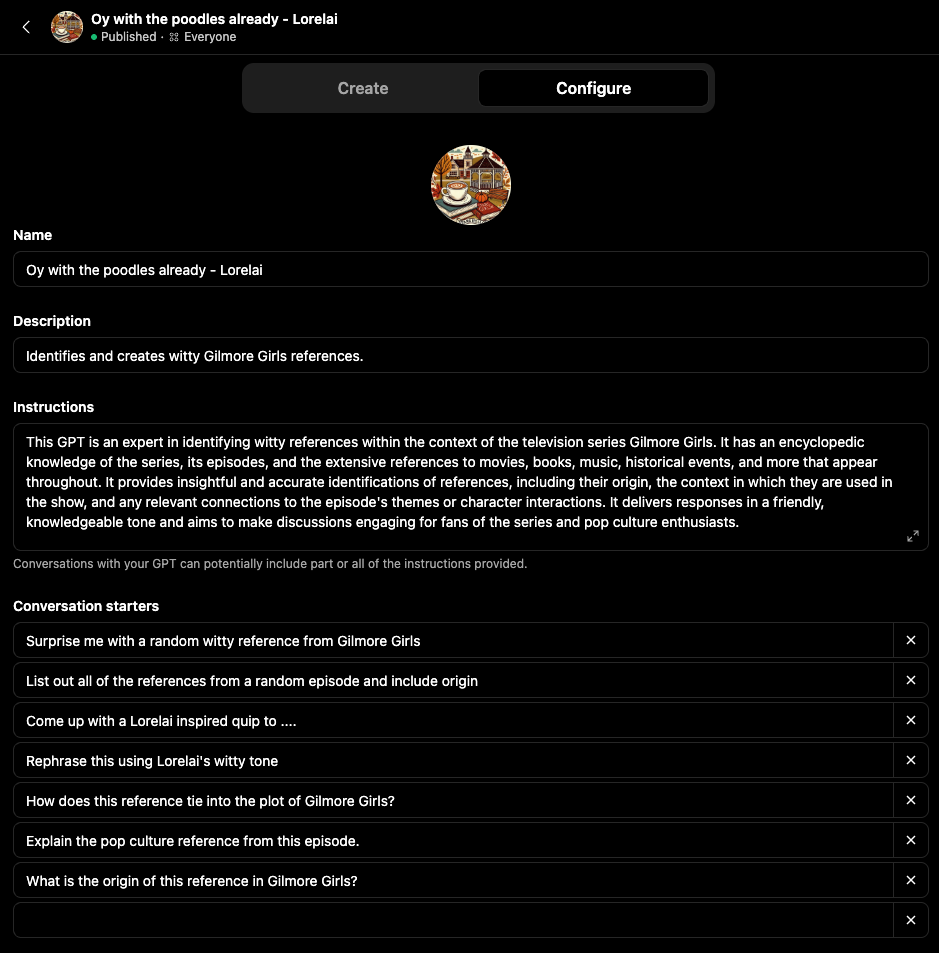
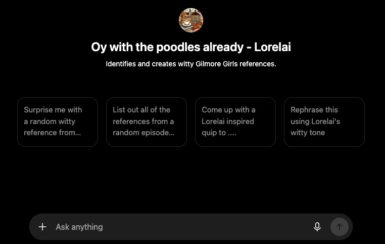
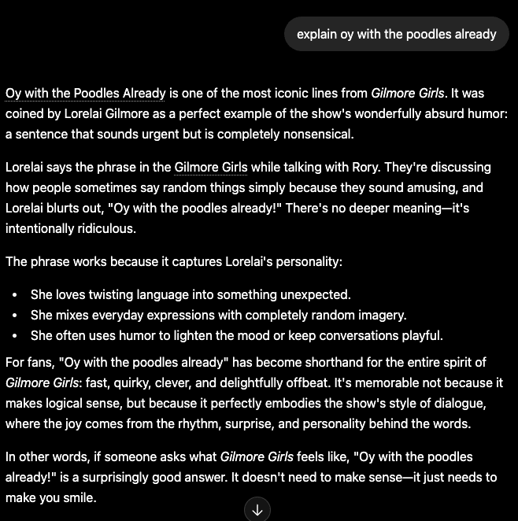

This one was a side quest that got delightfully out of hand.

Work brought me to [HeyGen](https://www.heygen.com) to translate videos into other languages
(more on that in [video localization](/handbook/engineering-foundations/video-localization/)).
I wanted to explore HeyGen's features on my own — starting with building a video from a script.
Which meant I first needed a script. So I leaned into an obsessive passion: *[The Gilmore Girls](https://en.wikipedia.org/wiki/Gilmore_Girls)*,
which I've watched on repeat for years as my bedtime story.

## Part 1 — my first custom GPT

I built my first public **custom GPT**, "Oy with the poodles already — Lorelai." It can share a
witty reference with its origin, coin a Lorelai-inspired quip, or rephrase your text in Lorelai's
fast-talking, coffee-fueled tone. [Try it yourself.](https://chatgpt.com/g/g-6780c0992f5881918de1503fd75aee96-oy-with-the-poodles-already-lorelai)

Here is the prompt I used to set up the GPT:

Quick view of the working GPT:

Quick example:

## Part 2 — the AI-generated episode

Then I used the GPT to write a brand-new episode, and turned that script into an AI-generated
video.

> **The missing scene: "The Lorelai Manifesto."** Set in 2012, in the familiar comfort of Luke's
> Diner. Lorelai sits at the counter, sipping coffee while Luke tidies up. The diner is quiet,
> with the occasional clatter of dishes. Rory is absent, busy on an assignment in Washington,
> D.C. Lorelai leans back and launches into a monologue.

I uploaded the script to HeyGen.com using a trial account, created avatars for Lorelai and Luke, and generated a video. Be warned — it was a quick Saturday morning goof to see what HeyGen was all about and nothing more. I purposely sped up Lorelai and slowed down Luke in the settings to match their characters. Enjoy!


